# JPApex Predators 📱

[](https://swift.org)
[](https://apple.com/ios)

This is a Apex Predators an APP based on Dinnosaurs, the project contains MapKit.

## 📸 Screenshots

### Highlights
| Main Screen | Predator Detail | Filtered Screen | SortedScreen |
|:---:|:---:|:---:|:---:|
| 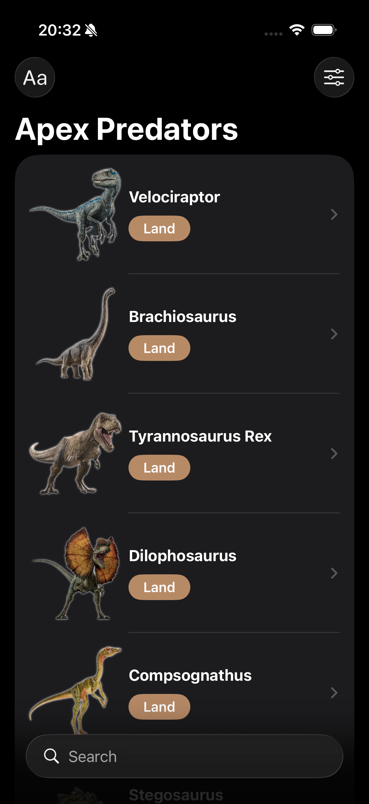 | 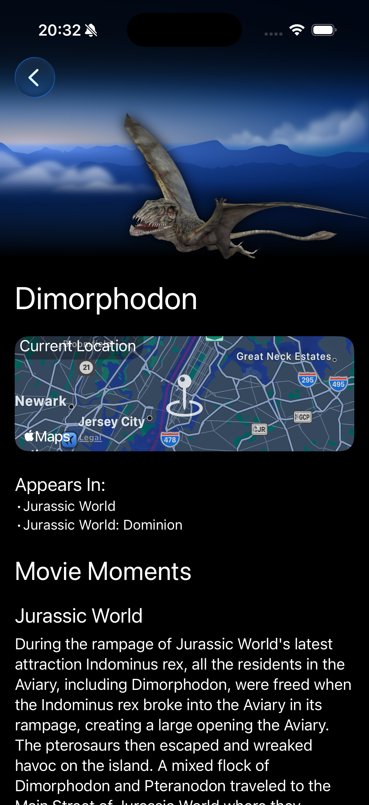 | 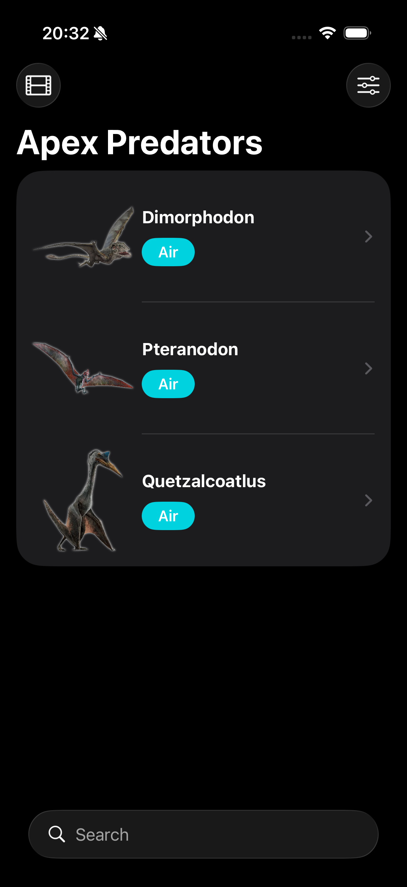 | 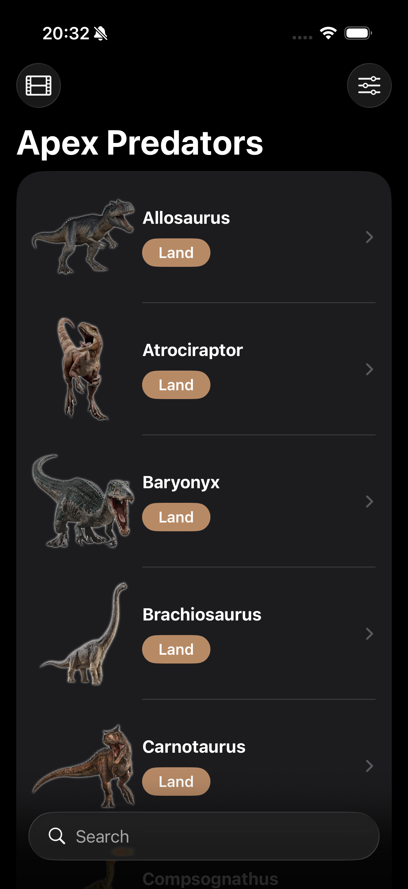 |

### Complete Gallery
Here you can see the app in action:

<p align="left">
  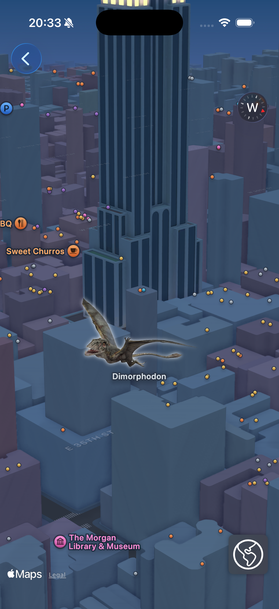
  
  
  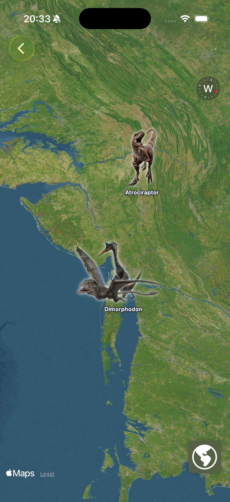
  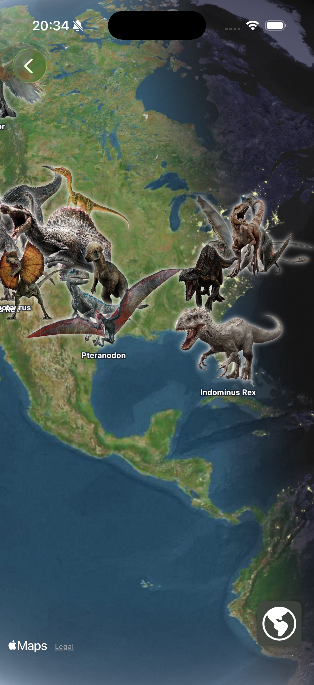
  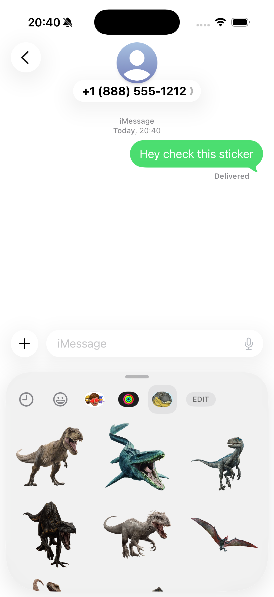
  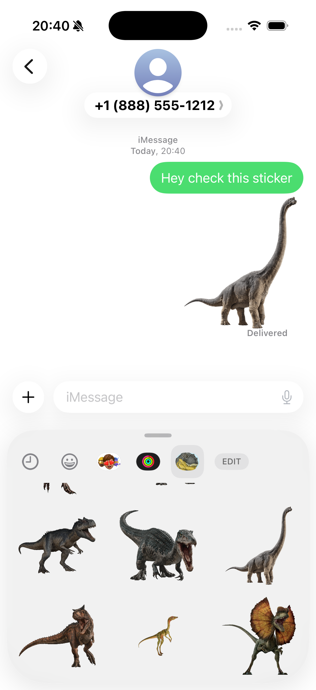
  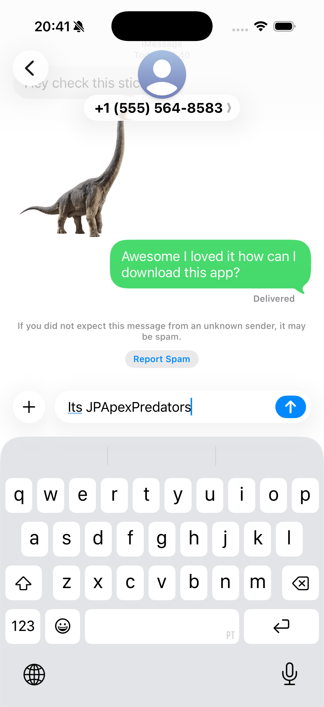
  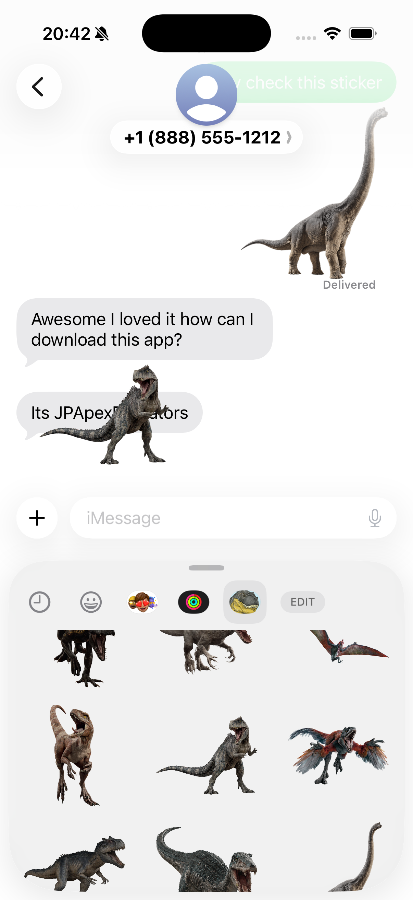
</p>

> [!TIP]
> <p align="left">
> 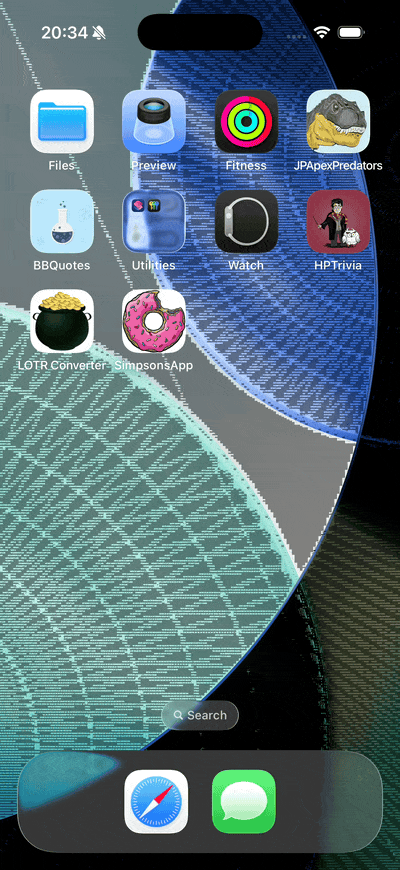</p>

## ✨ Features

- [x] Dinosaur Encyclopedia: A detailed guide of apex predators from the Jurassic Park universe, including dietary habits, types, and movie history.
- [x] Interactive Map Integration: Real-time location tracking of predators using MapKit, featuring custom markers and geographic data.
- [x] Interactive UI: Dynamic layouts built with SwiftUI, featuring dinnosaur-specific details.
- [x] Alphabetical & Search Functionality: Optimized navigation to quickly locate specific predators within the database.
- [x] Immersive Detail Views: UI layouts that combine maps, high-quality imagery, and technical stats for each predator.

## 🛠 Technologies and Tools

- **Language:** Swift 6.0
- **Interface:** SwiftUI
- **Framework:** MapKit, Foundation
- **Architeture:** MVVM
- **UI Components:** Map, NavigationStack, Toolbar

## 🚀 How to run the project

1. Clone Repository CoreData:
   ```bash
   git clone https://github.com/keykenzo/JPApexPredators.git
